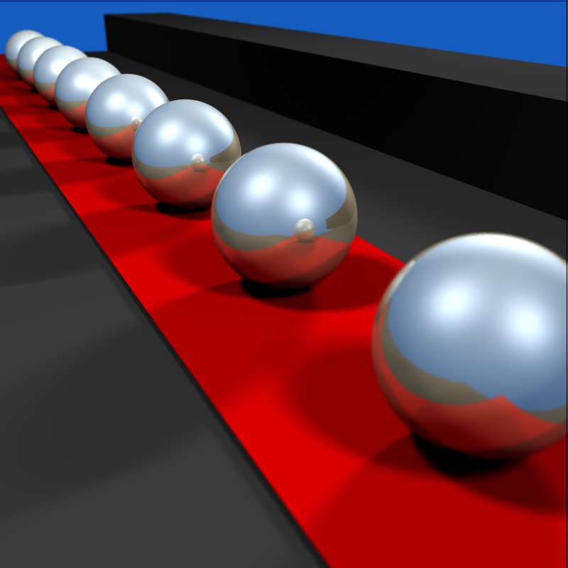

# 3D-Rendering

## Overview

This project is a C++ implementation of a 3D rendering engine that utilizes ray tracing techniques to generate photorealistic images from scratch. By parsing a scene description in NFF (Neutral File Format), the program constructs a virtual scene complete with a camera and various geometric objects.

The project was done as part of a 3D Programming course at the IST (University of Lisbon) in 2019 by Yannek Nowatzky and Ferdous Nasri.

## Features

- **Raycasting & Ray Tracing**: The engine implements advanced rendering techniques that simulate the way light interacts with objects, producing high-quality images.
- **Grid Search Acceleration**: Utilizes a grid-based acceleration structure to improve rendering performance, enabling faster ray-object intersection tests.
- **Reflections, Refractions, and Soft Shadows**: Implements reflective materials (mirror-like) and soft shadow effects for more realistic lighting, allowing for gradual transitions between light and shadow and bouncing light rays. 
- **Anti-Aliasing**: Reduces visual artifacts by smoothing edges through multi-sampling techniques, resulting in clearer and more detailed images.
- **Depth of Field Effects**: Simulates realistic depth of field, adding a sense of focus and blur that enhances the visual quality of rendered scenes.
- **Scene Definition**: Users can define their 3D scenes using NFF input files, allowing for easy customization of the camera position, object properties, and light sources.
- **Multi-threading Support**: The rendering process is optimized for performance with multi-threading capabilities, enabling faster image generation on modern multi-core processors.

## Showcase

Below is a rendered image showcasing the ray tracing engine's capabilities, including reflective materials, soft shadows, and anti-aliasing. A subtle depth of field effect is applied, keeping the third sphere in focus while adding gentle blurring to the foreground and background for a slight sense of depth.

        

## Installation and Usage

### Requirement

Requires the OpenGL Utility Toolkit (GLUT)
    
    sudo apt-get install freeglut3-dev

### Using Linux:

Download the repository and change (cd) into the directory. Build the project with

    make

This will create an executable filled, called *app*, which can be run from command line:

    ./app --scene <PATH TO SCENE>

Sample scenes are found in the _scenes_ directory. Consult the program's help function (_-h_) for adjusting camera properties and special effects.

    ./app -h
    Usage:
    --scene [path]           : Set scene file path
    --res_x [value]          : Set custom resolution width
    --res_y [value]          : Set custom resolution height
    --antialiasing [0/1]     : Enable or disable antialiasing
    --n [value]              : Set number n of pixel jitter for antialiasing
    --softshadows [0/1]      : Enable or disable soft shadows
    --depth_of_field [0/1]   : Enable or disable depth of field
    --aperture [value]       : Aperture for depth of field (Default 0.04)
    --focal_distance [value] : Distance to focal plane for depth of field (Default 3.0)
    --grid_acceleration [0/1]: Enable or disable grid acceleration
    -h  

### Using MacOS Mojave:
If you are running the program on MacOS Mojave, please look in the `main.cpp` file and set `MojaveWorkAround` to `true` and uncomment the three lined with the `#include` files, while commenting out the `#include` file listed under `For Linux`. You can then build the program using the following command:
`g++ main.cpp Scene.cpp Camera.cpp Object.cpp Sphere.cpp Plane.cpp Triangle.cpp VectorMath.cpp RayCast.cpp Cylinder.cpp AABB.cpp Vector.cpp Cell.cpp Grid.cpp RandomSampler.cpp -o app -framework OpenGL -framework GLUT -Wno-deprecated --std=c++17`

## Multi-threading:

Multi-threading is currently causing issues.

In theory, you can build the project with multi-threading by adding the tag `-fopenmp` to the Makefile compile flags. By default, all cores will be used. If need be, this can be changed by uncommenting a line in the `main.cpp`.

## Set input file:
We currently only accept NFF. You can change the input file in `main.cpp` by changing `scene_path`. The scene we have made to show the depth of field and the other new features is under this path: "./scenes/dof_example.nff". This is already set as the default path for the program.
